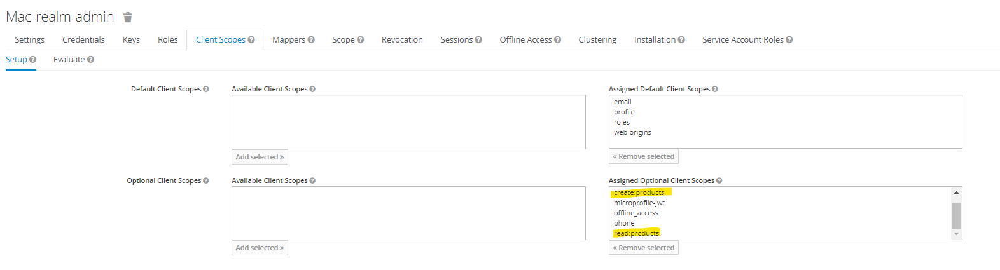
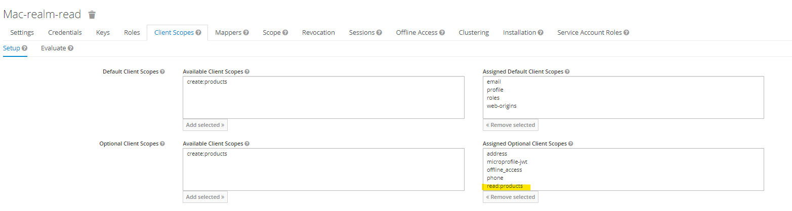

### Start Authorization Server 

**KeyCloak**

```
docker run -p 8080:8080 -e KEYCLOAK_ADMIN=admin -e KEYCLOAK_ADMIN_PASSWORD=admin quay.io/keycloak/keycloak:17.0.1 start-dev
```

### Get access_token

```
curl --location --request POST 'http://localhost:8080/realms/mac-realm/protocol/openid-connect/token' \
--header 'Content-Type: application/x-www-form-urlencoded' \
--data-urlencode 'grant_type=client_credentials' \
--data-urlencode 'client_id=mac-realm-admin' \
--data-urlencode 'client_secret=QwxekXXXXX' \
--data-urlencode 'scope=read:products create:products'

curl --location --request POST 'http://localhost:8080/realms/mac-realm/protocol/openid-connect/token' \
--header 'Content-Type: application/x-www-form-urlencoded' \
--data-urlencode 'grant_type=client_credentials' \
--data-urlencode 'client_id=mac-realm-read' \
--data-urlencode 'client_secret=00n3kBXXXXX' \
--data-urlencode 'scope=read:products'
```

### Call API

```
curl --location --request GET 'http://localhost:8081/products' \
--header 'Authorization: Bearer {ACCESS_TOKEN}'
```

### KeyCloak 

**Create Client**

Admin : read:products create:products


Read : read:products



### References 
* https://docs.spring.io/spring-security/reference/servlet/oauth2/resource-server/index.html
* https://www.baeldung.com/spring-security-method-security
* https://www.initgrep.com/posts/java/spring/spring-security-oauth2-jwt-authentication-resource-server
* https://laurspilca.com/consuming-an-endpoint-protected-by-an-oauth-2-resource-server-from-a-spring-boot-service/
